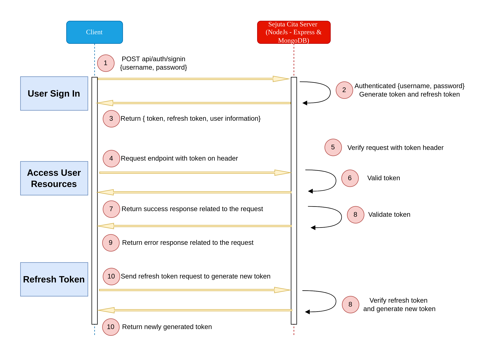

# Sejuta Cita Backend Engineer Assessment

## Overview

This project is intended to pass an backend engineer assessment of Sejuta Cita. The assessment is to create Restful CRUD API user and user login. Authentication implement access token in this project in order to authorize to access user resources with specific role.

Stack used in this project?

- NodeJs
- Express
- MongoDB
- Docker

## Authentication Diagram

## Running The App Locally

Requirement:

- Docker installed
- Docker Compose

How to run the app?

- Clone the source code
- Run `docker-compose up -d`
- Test the Restful API in the postman

For admin credential you can use username = admin and password = admin. I have populate admin user if it the first time the app is set up.

## Documentation API

In order to access the Restful API i have provide the documentation about the API. You can access the [Link](https://documenter.getpostman.com/view/11175460/UVeCPTHm) to read about the documentation. I also provide Sejuta Cita json format file and you can download the file and import it in your postman.

Last but not least, I hope i could join Sejuta Cita because I really interested in about the compay, service that they are provide, ect

That is so funny! :joy:
